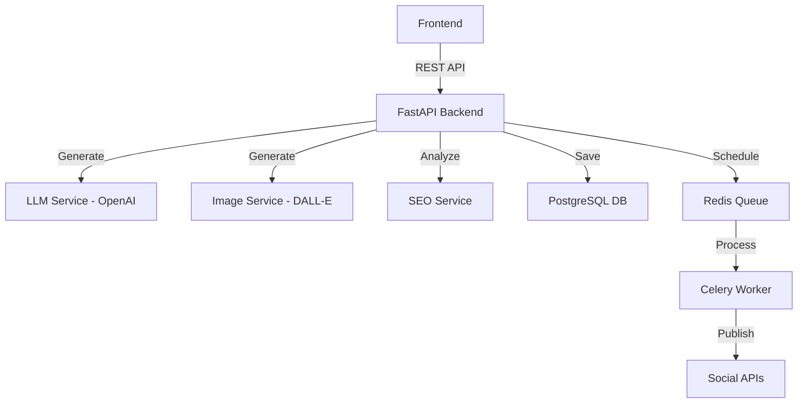

# Architecture & Workflow Diagrams

## System Overview
The AI Content Generator follows a modular micro-service style architecture within a FastAPI monolith, using Celery for background processing.

## Workflows

### 1. Content Generation Workflow
1. **User** submits a topic.
2. **Backend** calls GPT-4o with specialized SEO prompts.
3. **LLM** returns structured JSON (Title, Content, Keywords).
4. **Backend** triggers Image Generation for the hero section.
5. **SEO Service** calculates scoring before returning to User.

### 2. Scheduling Workflow
1. **User** selects a generated post and a time.
2. **Backend** creates a `Schedule` record in DB with `pending` status.
3. **Celery** task is enqueued with a `countdown` delay.
4. **Worker** wakes up at the execution time, calls the Social Publish service, and updates status to `sent`.

## Data Model Relationships
- **BlogPost** is the central entity.
- **SocialPost** has a Many-to-One relationship with **BlogPost**.
- **Images** can belong to a Blog (Hero) or a Social Post (Feed).
- **Analytics** is a One-to-One meta-table for performance tracking.
